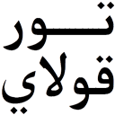

#  Torqolay
-------------------------------------
Google Chrome extension

## Installation

Install from the **[Chrome Web Store](https://chrome.google.com/webstore/detail/torqolay/kmpbgnbljnbcgddficmdnckeflinjieo)**.

Not available for **Firefox**,

## Usage

* Click on the  icon to open Options.
* Try & enjoy!

## DEMO

#### Before

#### After

## License
 * [GNU General Public License (GPLv3)](https://github.com/Oghouz/Torqolay/blob/master/LICENSE)
 * All Uyghur fonts from [UKIJ](http://www.ukij.org/fonts/) 
 * UY, ULY conversion script part from original [Yulghun.com](http://www.yulghun.com/) written by Mr. Muhemmed Abdullah.
 
